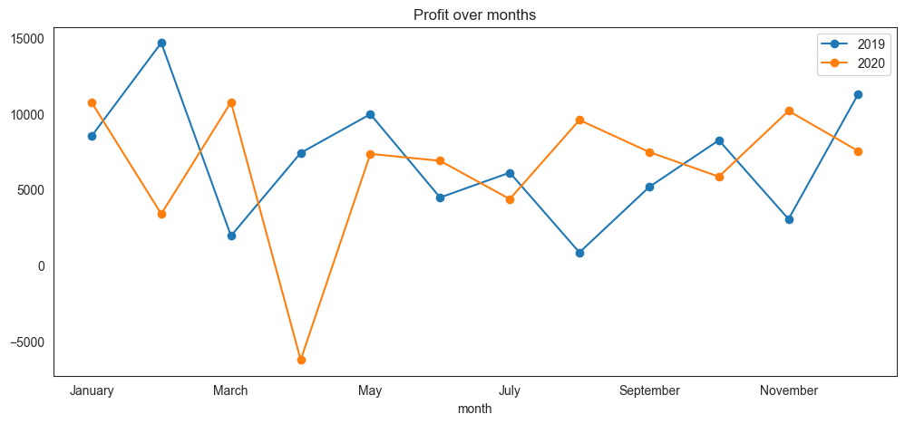
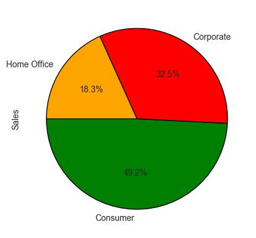
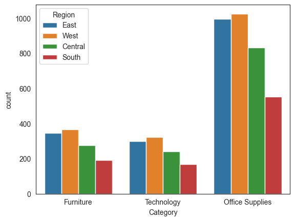
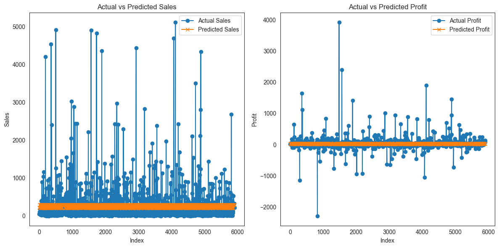

# **Sales and Profit Analysis and Prediction Model**

## **Overview**
This project involves analyzing and predicting sales and profit trends over time using a dataset with various features. The primary goal is to understand historical trends and forecast future sales and profits. The analysis includes data cleaning, visualization, and exploratory data analysis (EDA), followed by model building using linear regression. A Power BI dashboard was also created to visualize the findings and provide a 15-day sales forecast.

## **Dataset**
The dataset includes the following columns:
- **Order ID**: Unique identifier for each order.
- **Order Date**: Date when the order was placed.
- **Ship Date**: Date when the order was shipped.
- **Ship Mode**: Mode of shipment (e.g., Standard Class, Second Class, Same Day).
- **Customer ID**: Unique identifier for each customer.
- **Customer Name**: Name of the customer.
- **Segment**: Segment of the customer (e.g., Consumer, Corporate, Home Office).
- **Country**: Country where the order was placed.
- **City**: City where the order was placed.
- **State**: State where the order was placed.
- **Region**: Region where the order was placed.
- **Product ID**: Unique identifier for each product.
- **Category**: Category of the product (e.g., Office Supplies, Technology).
- **Sub-Category**: Sub-category of the product.
- **Product Name**: Name of the product.
- **Sales**: Sales amount for the order.
- **Quantity**: Quantity of the product ordered.
- **Profit**: Profit amount for the order.
- **Returns**: Indicator if the product was returned.
- **Payment Mode**: Mode of payment (e.g., Cash on Delivery, Cards).

## **Power BI Dashboard**
The Power BI dashboard provides a comprehensive visualization of the findings and forecasts. The dashboard includes several types of charts and analytics tools: 

### **Visualizations**
1. **Donut Chart**:
   - **Purpose**: To show the proportion of sales and profits across different categories or segments.
   - **Example**: A donut chart was used to display the percentage distribution of orders among the Consumer, Corporate, and Home Office segments.

2. **Cards**:
   - **Purpose**: To display key performance indicators (KPIs) such as total sales, total profit, and total number of orders.
   - **Example**: Cards were used to highlight the total sales and profits for the years 2019 and 2020, providing a quick summary for stakeholders.

3. **Line Chart**:
   - **Purpose**: To visualize trends over time, such as monthly sales and profit trends.
   - **Example**: Line charts were used to show the sales and profit trends over the months for 2019 and 2020, helping to identify peak and low periods.

4. **Map**:
   - **Purpose**: To display geographical distribution of sales and profits.
   - **Example**: A map visualization was used to show sales distribution across different regions, highlighting the areas with the highest and lowest sales.

### **Analytics for Forecasting**
1. **Trend Analysis**:
   - **Purpose**: To identify and analyze trends in sales and profit over time.
   - **Example**: Using line charts, trends were analyzed to understand how sales and profit have evolved over the months and years.

2. **Forecasting**:
   - **Purpose**: To predict future sales and profit based on historical data.
   - **Example**: A 15-day sales forecast was generated using the historical sales data, providing insights into expected future performance.

### **Key Insights from Power BI Dashboard**
- **Sales Growth**: Clear growth in sales from 2019 to 2020, with significant spikes in February 2020.
- **Profit Peaks**: Maximum profit observed in February 2019 and January/March 2020.
- **Regional Sales**: Highest number of orders from the Western region, with the least from the Southern region.
- **Payment Preferences**: Most orders were Cash on Delivery (COD), with the least using pre-paid Cards.
- **Category Performance**: Office Supplies had the highest sales, especially in the Western and Eastern regions.
- **Segment Distribution**: Consumer segment was the largest ordering sector, followed by Corporate and Home Office.

## **Data Cleaning and Exploratory Data Analysis (EDA) Using Pandas and Matplotlib**
### **Key Observations**
- **Sales Trends**:
  - Sales in 2020 increased compared to 2019.
  - Maximum increase in sales observed in February 2020, with an increase of around 250%.
  - Highest sales in the Consumer segment occurred in November 2019 and December 2020.
  - Lowest sales in the Consumer segment were in April 2019 and April 2020.
  
- **Profit Trends**:
  - Maximum profit was observed in February 2019.
  - Maximum profit in 2020 was in January and March.
  - Loss was observed in April 2020.
  - Profit trends showed that the consumer sector had the highest profit in office supplies and technology, while the home office sector had a loss in furniture.

- **Shipment Mode**:
  - Most orders were shipped via Standard Class, with the least being shipped on the same day.
  
- **Regional Distribution**:
  - Most orders were from the Western region, and the least from the Southern region.
  
- **Payment Mode**:
  - The majority of orders were paid using Cash on Delivery (COD), with the least being pre-paid through Cards.
  
- **Category and Segment Analysis**:
  - Highest sales were observed in Office Supplies, particularly in the Western and Eastern regions.
  - Most office supplies orders belonged to the Consumer segment.
  - The sub-category with the most orders was Binders, followed by Paper and Furnishings. The least ordered items were Copiers and Machines.
  - The Consumer segment accounted for 49.2% of orders, making it the largest ordering sector, followed by Corporate (32.5%) and Home Office (18.3%).
  
  
  
  

## **Predictive Modeling**
Linear regression models were built to predict sales and profit over time. The steps included:

1. **Feature Engineering**: Extracting year and month from the `order_date`.
2. **Train-Test Split**: Splitting the data into training and testing sets.
3. **Model Training**: Training linear regression models for sales and profit.
4. **Evaluation**: Using Mean Squared Error (MSE), Mean Absolute Error (MAE), and R-squared (R²) to evaluate the models.

## **Conclusion**
This analysis provides valuable insights into sales and profit trends, regional distribution, shipment modes, and customer segments. The linear regression models and the Power BI dashboard enable stakeholders to make informed decisions based on historical data and future forecasts.

## **Future Work**
- Incorporate more sophisticated time-series forecasting models such as ARIMA or Prophet.
- Expand the analysis to include more detailed customer behavior insights.
- Continuously update the Power BI dashboard with new data to maintain accurate forecasting.

## **Files Included**
- Jyupeter notebook for data cleaning, EDA, and predictive modeling.
- Power BI dashboard file with visualizations and forecasts.
- Superstore sales dataset (.csv)
- ReadMe file (this document).

## **How to Run the Code**
1. Ensure you have Python and necessary libraries installed (`pandas`, `numpy`, `matplotlib`, `seaborn`, `sklearn`).
2. Run the Python scripts in sequence to perform data cleaning, EDA, and model training.
3. Open the Power BI dashboard file to view the visualizations and forecasts.

